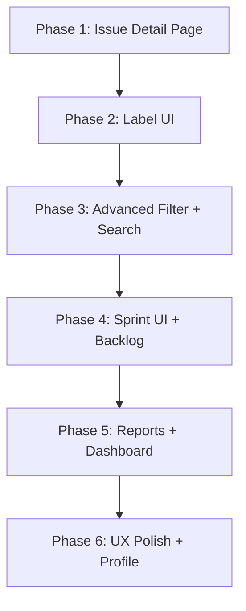

# 📋 IT4409 – Kế Hoạch Nâng Cấp Toàn Diện (Jira-like App)

> **Phân tích ngày:** 2026-05-17  
> **Trạng thái dự án hiện tại:** BE đã wiring đầy đủ module, nhưng FE chưa kết nối hầu hết API; UI còn thiếu nhiều trang/component quan trọng.

---

## 🔍 Phân Tích Hiện Trạng

### ✅ Đã có (BE + FE đều hoạt động)
| Tính năng | BE | FE UI |
|---|---|---|
| Auth (Login/Register/Logout) | ✅ | ✅ |
| Tạo/Xem Project | ✅ | ✅ |
| Kanban Board (kéo thả cột) | ✅ | ✅ |
| Tạo Issue (modal) | ✅ | ✅ |
| Đổi trạng thái issue (drag-drop) | ✅ | ✅ |
| Quản lý members + invite | ✅ | ✅ |
| Sprint CRUD + Start/Complete | ✅ | ✅ (chỉ create) |
| Activity log (project level) | ✅ | ✅ (basic) |
| WebSocket reconnect | ✅ | ✅ |

### ❌ Đã có BE nhưng FE chưa làm UI
| Tính năng | BE | FE API wrapper | FE UI |
|---|---|---|---|
| **Label CRUD** | ✅ | 🧩 Wrapper only | ❌ Không có UI |
| **Gắn/gỡ label cho issue** | ✅ | 🧩 Wrapper only | ❌ |
| **Comment (thêm/sửa/xóa)** | ✅ | 🧩 Wrapper only | ❌ Issue detail không có comment box |
| **Issue Detail đầy đủ** | ✅ | 🧩 getIssue | ❌ `IssueDetailsPage` rất sơ sài |
| **Assign issue** | ✅ | 🧩 assignIssue | ❌ Issue detail không có dropdown |
| **Subtask** | ✅ | 🧩 listSubtasks | ❌ |
| **Filter nâng cao** | ✅ | ❌ | ❌ Chỉ có search title |
| **Activity log per-issue** | ✅ | 🧩 getIssueActivity | ❌ |
| **Update issue (edit fields)** | ✅ | 🧩 updateIssue | ❌ |
| **Delete issue** | ✅ | 🧩 deleteIssue | ❌ |
| **Search toàn hệ thống** | ✅ | 🧩 searchApi | ❌ |
| **Attachment** | ✅ | 🧩 attachmentApi | ❌ |
| **Reporter** | ✅ (field) | ✅ | ❌ Hiển thị trong issue detail |
| **Ngày tạo/ngày update** | ✅ (field) | ✅ | ❌ Không hiển thị rõ |
| **Due date** | ✅ (field) | ✅ | ❌ Chỉ có trong create, không edit được |
| **Sprint management UI** | ✅ | ✅ | ⚠️ Chỉ Create Sprint, chưa Start/Complete trong UI |
| **Workflow history** | ✅ | 🧩 | ❌ Không có timeline |
| **Report** | ❌ | ❌ | ❌ |
| **User profile edit** | ✅ | 🧩 | ❌ |

### ❌ Hoàn toàn thiếu cả BE lẫn FE
| Tính năng |
|---|
| Notification system (in-app) |
| Email notification (optional) |
| Report: Burndown chart |
| Report: Velocity chart |
| Export issues to CSV |
| Custom workflow (tạo trạng thái custom) |

---

## 📐 Kiến Trúc Tổng Thể Các Thay Đổi



---

## 🚀 Phase 1: Issue Detail Page (Quan Trọng Nhất)

### Mục tiêu
Trang `IssueDetailsPage` phải đầy đủ như Jira: xem/edit tất cả fields, comment, subtask, activity.

### 1.1 BE: Nâng cấp Issue DTO (trả thêm labels + assignee info)

**File:** `BE/internal/delivery/http/handler/issue_handler.go`

Vấn đề hiện tại: `IssueDTO` chỉ trả `assigneeId` (UUID), FE phải gọi thêm `/api/users/{id}` để lấy tên/avatar. Cần thêm enriched response.

```go
// IssueDetailDTO - dùng cho GET /api/issues/{key}
type IssueDetailDTO struct {
    IssueDTO
    Labels   []LabelDTO        `json:"labels"`
    Assignee *UserSummaryDTO   `json:"assignee,omitempty"`
    Reporter *UserSummaryDTO   `json:"reporter"`
}

type UserSummaryDTO struct {
    ID        string `json:"id"`
    Name      string `json:"name"`
    Email     string `json:"email"`
    AvatarURL string `json:"avatarUrl"`
}
```

**Thay đổi cần làm:**
- `GET /api/issues/{issueKey}` → trả `IssueDetailDTO` (JOIN labels + user info)
- Thêm `GetByKeyWithDetail(ctx, key)` trong IssueRepo JOIN với labels table và users table

### 1.2 BE: Thêm label filter vào ListIssues

**File:** `BE/internal/domain/issue.go` + `BE/internal/repository/postgres/issue_repo.go`

```go
// Thêm vào IssueFilter
type IssueFilter struct {
    // ...existing fields...
    LabelID  string  // filter by label
    Reporter string  // filter by reporter UUID
}
```

SQL cần thêm: JOIN với `issue_labels` khi filter.LabelID không rỗng.

### 1.3 FE: Xây IssueDetailsPage đầy đủ

**File:** `FE/my-react-app/src/features/issues/pages/IssueDetailsPage.jsx`

Layout chuẩn Jira (2-column):
```
┌─────────────────────────┬──────────────────────┐
│ [Back] PROJ-42          │  Details Sidebar      │
│ ─────────────────────── │  ─────────────────── │
│ 🐛 Bug  [High]  [Todo]  │  Assignee: [select]  │
│                         │  Reporter: User name  │
│ Title (editable)        │  Priority: [select]  │
│                         │  Type: [select]       │
│ Description (editable)  │  Sprint: name         │
│                         │  Labels: [tags]       │
│ ── Subtasks ──          │  Due Date: [picker]  │
│  □ PROJ-43 ...          │  Created: 2024-01-01  │
│  □ PROJ-44 ...          │  Updated: 2h ago      │
│  [+ Add subtask]        │                       │
│                         │  [Delete Issue]       │
│ ── Activity & Comments ─│                       │
│ Timeline...             │                       │
│ [Comment box]           │                       │
└─────────────────────────┴──────────────────────┘
```

**Components cần tạo:**
- `IssueHeader.jsx` – title editable inline, type/priority/status badges
- `IssueDescription.jsx` – textarea với auto-save (debounced PATCH)
- `IssueSidebar.jsx` – assignee select, labels, dates, reporter
- `SubtasksList.jsx` – list subtasks + form tạo subtask mới
- `CommentSection.jsx` – list comments + add/edit/delete
- `ActivityTimeline.jsx` – timeline dọc hiển thị activity
- `LabelPicker.jsx` – dropdown chọn labels từ project (gắn/gỡ)

**API calls cần wire:**
```javascript
// issueApi.js - cần thêm
export function getIssueDetail(issueKey)  // GET /api/issues/{key} → detail
export function updateIssuePatch(issueKey, patch) // PATCH /api/issues/{key}
export function deleteIssue(issueKey) // DELETE /api/issues/{key}

// commentApi.js - cần wire
export function listComments(issueKey)
export function addComment(issueKey, content)
export function editComment(commentId, content)
export function deleteComment(commentId)

// labelApi.js - cần wire
export function attachLabel(issueKey, labelId)
export function detachLabel(issueKey, labelId)
```

### 1.4 FE: Inline Edit Fields

Tất cả fields trong IssueDetailsPage cần inline-edit (click → input → blur/Enter = auto-save):
- Title: `<h1>` → `<input>` on click
- Description: View mode (rendered markdown) → textarea on click
- Assignee: Select dropdown
- Priority: Select dropdown  
- Status: Select/badge dropdown
- Due Date: Date input
- Labels: Multi-select tag input

**Auto-save pattern:**
```javascript
const debouncedPatch = useMemo(
  () => debounce(async (field, value) => {
    await updateIssue(issueKey, { [field]: value })
    // activity log auto-generated by BE
  }, 600),
  [issueKey]
)
```

---

## 🏷️ Phase 2: Label Management UI

### 2.1 FE: Label Management Panel trong Project Settings

**New component:** `FE/.../features/labels/components/LabelManager.jsx`

UI:
```
Project Labels
─────────────
[● Bug] #ef4444  [Edit] [Delete]
[● Feature] #6366f1  [Edit] [Delete]
[+ New Label] ← modal: name + color picker
```

**Kết nối API:** `GET /api/projects/{id}/labels`, `POST`, `PATCH`, `DELETE`

### 2.2 FE: Label Filter trong Backlog/Board

Thêm dropdown filter labels ở header của Board view và Backlog:
```
[Search] [Status▼] [Assignee▼] [Labels▼] [Priority▼] [Sprint▼]
```

**Thay đổi App.jsx:** Thêm `filterLabels` state, truyền vào `refetchIssues` params.

### 2.3 FE: Label display trên Board cards

Hiển thị label badges trên board cards và backlog rows:
```jsx
{issue.labels?.map(l => (
  <span key={l.id} className="label-tag" style={{ background: l.color }}>
    {l.name}
  </span>
))}
```

> [!IMPORTANT]
> Labels trong issue response phải là enriched objects `{id, name, color}`, không phải chỉ IDs.
> Cần nâng cấp BE response hoặc join ở FE với labels list.

---

## 🔍 Phase 3: Advanced Filter & Global Search

### 3.1 FE: Filter Bar cho Board + Backlog

**Component:** `FilterBar.jsx`

```
┌────────────────────────────────────────────────────────────────┐
│ [🔍 Search...]  [Status: All▼] [Type▼] [Priority▼]           │
│ [Assignee▼] [Labels▼] [Sprint▼] [Reporter▼] [Due Date▼]      │
│                                          [Clear all filters]   │
└────────────────────────────────────────────────────────────────┘
```

State:
```javascript
const [filters, setFilters] = useState({
  search: '',
  status: '',
  type: '',
  priority: '',
  assignee: '',
  label: '',
  sprint: '',
  reporter: '',
  dueDateFrom: '',
  dueDateTo: '',
  sort: 'created_at',
  order: 'desc',
})
```

### 3.2 FE: Global Search Modal

**Component:** `GlobalSearch.jsx` – triggered by `Cmd+K` / click search icon in topbar.

```
┌──────────────────────────────────────────────────────┐
│ 🔍 Search issues, projects...           [Esc to close]│
├──────────────────────────────────────────────────────┤
│ Recent                                               │
│  ● PROJ-42 Fix login button  [Bug] [High]            │
│  ● PROJ-38 Update dashboard  [Task] [Medium]         │
├──────────────────────────────────────────────────────┤
│ Results for "login"                                  │
│  ● PROJ-42 Fix login button                          │
│  ● PROJ-15 Login page redesign                       │
└──────────────────────────────────────────────────────┘
```

**API:** `GET /api/search?q=keyword` (FE wrapper đã có: `searchApi.js`)

### 3.3 BE: Thêm `reporter` filter và `label` filter vào ListIssues

**File:** `BE/internal/repository/postgres/issue_repo.go`

```go
// Thêm vào List() filter logic:
if filter.Reporter != "" {
    where = append(where, fmt.Sprintf("reporter_id = $%d", argIdx))
    args = append(args, filter.Reporter)
    argIdx++
}
if filter.LabelID != "" {
    where = append(where, fmt.Sprintf(
        "id IN (SELECT issue_id FROM public.issue_labels WHERE label_id = $%d)", argIdx,
    ))
    args = append(args, filter.LabelID)
    argIdx++
}
```

---

## 🏃 Phase 4: Sprint UI + Backlog đầy đủ

### 4.1 FE: Sprint Management Panel

**Component:** `SprintPanel.jsx` (thay thế placeholder trong sidebar)

```
Sprint 1 - Q2 Planning          [Active]
  ├─ Start: 2024-05-01  End: 2024-05-14
  ├─ Goal: "Deliver auth module"
  ├─ Progress: ████████░░ 80%
  ├─ [Complete Sprint]
  └─ Issues: 12/15 done

[+ Create New Sprint]
```

**Handlers cần wire:**
- `handleStartSprint(sprintId)` – đã có trong App.jsx nhưng chưa có UI button
- `handleCompleteSprint(sprintId)` – tương tự
- `updateSprint(sprintId, {name, goal, startDate, endDate})` – chưa có UI

### 4.2 FE: Backlog View đầy đủ

Hiện tại Backlog chỉ list issues. Cần nâng cấp thành layout đúng Jira:

```
Backlog View
──────────────────────────────────
Sprint 1 (Active) [14 issues]    [Complete Sprint]
  ─────────────────────────────────
  [🐛 PROJ-42] Fix login [High]  [In Progress] [@John]
  [📝 PROJ-43] Update API [Med]  [Todo]        [@Jane]
  [+ Create Issue in Sprint]

Sprint 2 (Planning) [8 issues]   [Start Sprint]
  ─────────────────────────────────
  ...

Backlog [22 issues]              [+ Create Sprint]
  ─────────────────────────────────
  [📝 PROJ-10] Old task [Low]    [Todo]
  [+ Create Issue in Backlog]
```

**State mới cần thêm:** `sprintIssues` (issues per sprint), groupBy sprint logic.

### 4.3 FE: Drag-and-drop giữa Sprints

Kéo issue từ Backlog → Sprint và ngược lại bằng PATCH `{sprint_id: newSprintId}`.

---

## 📊 Phase 5: Reports & Dashboard

### 5.1 BE: Report Endpoints

**Cần thêm 2 endpoints:**

```
GET /api/projects/{projectID}/reports/summary
  → { totalIssues, openIssues, doneIssues, byType[], byPriority[], byAssignee[] }

GET /api/projects/{projectID}/reports/burndown?sprintId=...
  → { dates[], ideal[], actual[] }  // cho burndown chart
```

**File mới cần tạo:**
- `BE/internal/delivery/http/handler/report_handler.go`
- `BE/internal/usecase/report_usecase.go`
- `BE/internal/repository/report_repository.go`

### 5.2 FE: Reports Panel (thay placeholder)

**Component:** `ReportsPanel.jsx`

Tabs:
- **Summary**: Bar chart issues by type, Pie chart by priority, Table by assignee
- **Burndown**: Line chart Sprint burndown (ideal vs actual)
- **Velocity**: Bar chart completed issues per sprint

**Library**: dùng `recharts` (npm install recharts) hoặc Chart.js qua `react-chartjs-2`

```jsx
// Summary tab
<ResponsiveContainer width="100%" height={300}>
  <BarChart data={byTypeData}>
    <Bar dataKey="count" fill="#6366f1" />
    <XAxis dataKey="type" />
    <YAxis />
    <Tooltip />
  </BarChart>
</ResponsiveContainer>
```

### 5.3 FE: Dashboard Overview nâng cấp

Dashboard hiện chỉ có StatsCards + RecentProjects + AssignedToMe.

Cần thêm:
- **Sprint Progress Widget**: current sprint burndown mini-chart
- **Team Workload Widget**: bar chart issues per member
- **Recently Updated Issues**: last 5 updated issues với timestamp
- **Activity Timeline**: merged từ activityLog (đã có data)

---

## 🎨 Phase 6: UX Polish + Profile + Misc

### 6.1 FE: User Profile Page

**Route:** `/profile` hoặc modal từ avatar click

```
┌─────────────────────────────────┐
│  [Avatar]  John Doe             │
│  john@email.com                 │
│  ─────────────────────────────  │
│  Display Name: [input]          │
│  Avatar URL: [input]            │
│  [Change Password]              │
│  [Save Changes]                 │
└─────────────────────────────────┘
```

**API:** `PATCH /api/users/me`, `POST /api/auth/change-password`

### 6.2 FE: Notification Bell

**Component:** `NotificationBell.jsx` – drop-down từ bell icon trong topbar

Nội dung:
- Issue được assign cho bạn
- Comment trên issue bạn đang watch
- Sprint started/completed trong project bạn thuộc về

**Nguồn data:** WebSocket events + activity log filtered by `userId === currentUser.id`

### 6.3 FE: Keyboard Shortcuts

| Shortcut | Hành động |
|---|---|
| `C` | Create issue |
| `Cmd+K` / `Ctrl+K` | Global search |
| `B` | Toggle backlog/board |
| `Esc` | Close modal |
| `?` | Show shortcuts help |

### 6.4 FE: Issue Status Transitions (visual workflow)

Hiển thị allowed transitions thay vì free-form select:
```
[Todo] → [In Progress] → [In Review] → [Done]
         ↘─────────────────────────→ [Cancelled]
```

Component `StatusTransitionDropdown.jsx` chỉ show valid next states.

### 6.5 FE: Empty States & Loading Skeletons

- Board với no issues: illustration + "Create your first issue"
- Loading: skeleton cards thay vì spinner
- Error: retry button

### 6.6 BE: Fix Issues cần sửa ngay

1. **Issue Update COALESCE bug**: `COALESCE($2, title)` không thể set field về `NULL` và không thể clear `assignee_id`. Cần dùng pattern pointer-based hoặc JSON Merge Patch.

2. **Comment response**: chưa có `authorName`/`authorAvatar` trong CommentDTO → FE phải gọi riêng từng user.

3. **Label filter trong ListIssues**: chưa có trong `IssueFilter` domain.

---

## 📁 Danh Sách File Cần Tạo/Sửa

### Backend (Go)

| File | Loại | Nội dung |
|---|---|---|
| `BE/internal/domain/issue.go` | MODIFY | Thêm `LabelID`, `Reporter` vào `IssueFilter` |
| `BE/internal/domain/report.go` | NEW | `ReportSummary`, `BurndownPoint` entities |
| `BE/internal/repository/postgres/issue_repo.go` | MODIFY | Thêm label/reporter filter, `GetByKeyWithDetail` |
| `BE/internal/usecase/issue_usecase.go` | MODIFY | `GetIssueDetail` trả enriched DTO |
| `BE/internal/usecase/report_usecase.go` | NEW | `GetSummary`, `GetBurndown` |
| `BE/internal/delivery/http/handler/issue_handler.go` | MODIFY | `GetIssue` trả `IssueDetailDTO` |
| `BE/internal/delivery/http/handler/report_handler.go` | NEW | `GetSummary`, `GetBurndown` handlers |
| `BE/internal/delivery/http/router/router.go` | MODIFY | Register report routes |
| `BE/migrations/011_label_filter_index.up.sql` | NEW | Index trên `issue_labels` |

### Frontend (React)

| File | Loại | Nội dung |
|---|---|---|
| `FE/.../features/issues/pages/IssueDetailsPage.jsx` | REWRITE | Full Jira-like detail page |
| `FE/.../features/issues/components/IssueHeader.jsx` | NEW | Title + badges + actions |
| `FE/.../features/issues/components/IssueSidebar.jsx` | NEW | All metadata fields |
| `FE/.../features/issues/components/SubtasksList.jsx` | NEW | Subtasks management |
| `FE/.../features/issues/components/CommentSection.jsx` | NEW | Comments CRUD |
| `FE/.../features/issues/components/ActivityTimeline.jsx` | NEW | History timeline |
| `FE/.../features/issues/components/LabelPicker.jsx` | NEW | Multi-select labels |
| `FE/.../features/issues/components/StatusTransition.jsx` | NEW | Visual state machine |
| `FE/.../features/labels/components/LabelManager.jsx` | NEW | CRUD labels panel |
| `FE/.../features/sprints/components/SprintPanel.jsx` | NEW | Sprint management |
| `FE/.../features/sprints/components/BacklogView.jsx` | NEW | Full backlog layout |
| `FE/.../features/reports/components/ReportsPanel.jsx` | NEW | Charts + stats |
| `FE/.../features/reports/api/reportApi.js` | NEW | Report API calls |
| `FE/.../shared/components/FilterBar.jsx` | NEW | Advanced filter bar |
| `FE/.../shared/components/GlobalSearch.jsx` | NEW | Cmd+K search |
| `FE/.../features/users/pages/ProfilePage.jsx` | NEW | User profile edit |
| `FE/.../App.jsx` | MODIFY | Wire new components + routes |
| `FE/.../App.css` | MODIFY | New CSS for all new components |

---

## ⚡ Thứ Tự Ưu Tiên Thực Hiện

| Priority | Phase | Impact | Effort |
|---|---|---|---|
| 🔴 **P0** | Issue Detail Page (Phase 1) | Rất cao – core feature | Cao |
| 🔴 **P0** | Comment Section (Phase 1.4) | Rất cao | Trung bình |
| 🟠 **P1** | Label UI (Phase 2) | Cao | Trung bình |
| 🟠 **P1** | Sprint UI complete (Phase 4.1) | Cao | Trung bình |
| 🟡 **P2** | Backlog View full (Phase 4.2) | Trung bình | Cao |
| 🟡 **P2** | Filter Bar (Phase 3.1) | Trung bình | Thấp |
| 🟢 **P3** | Reports (Phase 5) | Thấp-Trung | Cao |
| 🟢 **P3** | Global Search (Phase 3.2) | Trung bình | Trung bình |
| ⚪ **P4** | Profile Page (Phase 6.1) | Thấp | Thấp |
| ⚪ **P4** | Notifications (Phase 6.2) | Thấp | Trung bình |

---

## 🔧 Cài Đặt Dependencies Cần Thiết

```bash
# Frontend - charts
cd FE/my-react-app
npm install recharts

# Frontend - date picker (nếu cần)
npm install react-datepicker

# Frontend - markdown renderer (optional, cho description)
npm install react-markdown
```

---

## 📝 Ghi Chú Kỹ Thuật

> [!WARNING]
> **Issue Update COALESCE Bug**: SQL hiện tại `COALESCE($n, field)` không thể clear field về NULL (e.g., clear assignee → unassign). Cần fix trước khi triển khai inline edit. Solution: sử dụng conditional SET syntax hoặc explicit null patch pattern.

> [!NOTE]
> **FE State Management**: App.jsx hiện đang quá lớn (1887 lines). Khi thêm Issue Detail state, nên extract sang `useIssueDetail` custom hook trong `features/issues/hooks/`.

> [!TIP]
> **IssueDetailDTO enrichment**: Thay vì sửa BE response, có thể enrich ở FE sau khi get issue: gọi parallel `getIssue()` + `listComments()` + `getIssueActivity()` + `listSubtasks()`. Đơn giản hơn và không cần join ở DB.

> [!IMPORTANT]
> **Copilot.md cần cập nhật** sau mỗi phase hoàn thành để giữ sync context.
